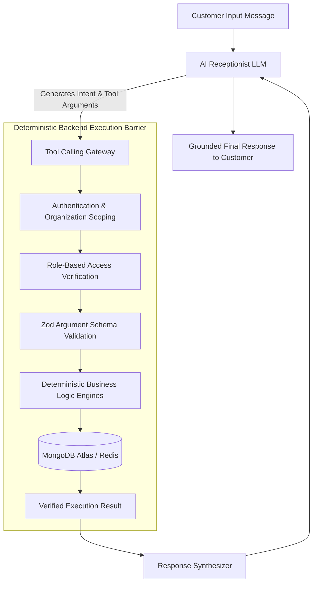
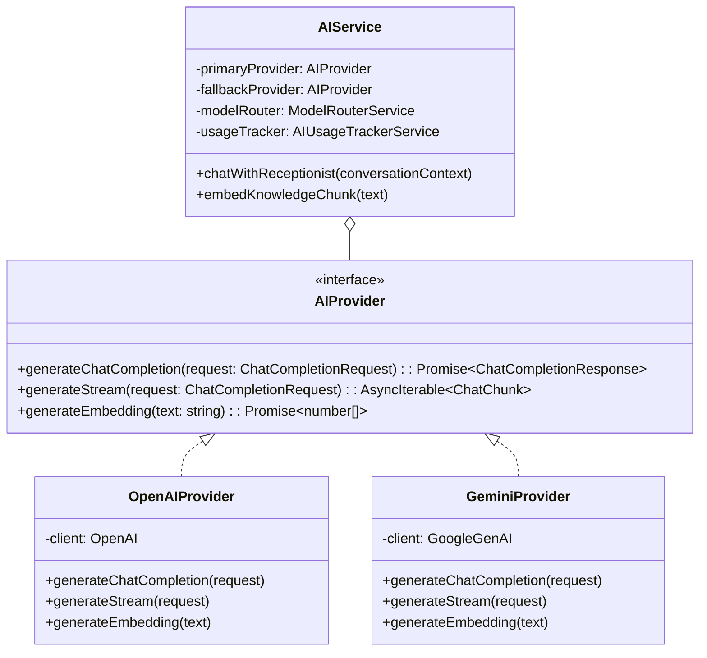
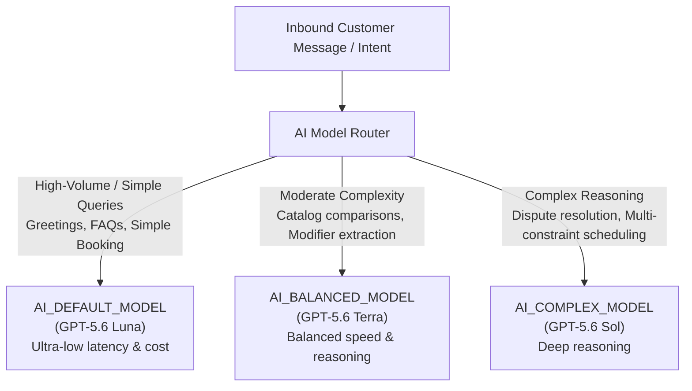
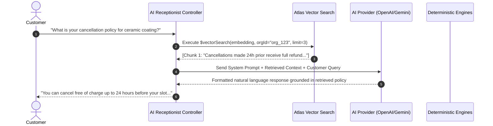

# AI Architecture, Provider Abstraction & RAG — SERVORA

---

## 1. Core AI Philosophy: Deterministic Authority

Servora establishes an unequivocal architectural rule: **Large Language Models (LLMs) are conversational interfaces and natural language interpreters, NOT sources of truth.**



### Inviolable AI Guardrails:
1. **Zero Hallucinated Pricing:** The LLM cannot quote a custom price. It must invoke `calculate_quote()`.
2. **Zero Hallucinated Availability:** The LLM cannot promise appointment times. It must invoke `get_availability()`.
3. **Zero Phantom Bookings:** The LLM cannot confirm an appointment unless `create_booking()` returned an explicit `bookingId`.
4. **Tenant Scoping:** The LLM cannot query or infer cross-tenant context.

---

## 2. Multi-Provider Abstraction Architecture

To avoid vendor lock-in and enable intelligent fallbacks, Servora implements an abstract AI service layer decoupling the application from specific AI providers:



### Centralized Model Configuration & Routing Abstraction
Model identifiers are managed centrally and mapped to conceptual environment variables, decoupling business logic completely from specific model names:

- `AI_DEFAULT_MODEL`: High-volume / simple customer interactions (default: **GPT-5.6 Luna**)
- `AI_BALANCED_MODEL`: Moderate complexity / multi-intent reasoning (default: **GPT-5.6 Terra**)
- `AI_COMPLEX_MODEL`: Complex reasoning / edge-case disambiguation (default: **GPT-5.6 Sol**)

```typescript
export interface AIModelConfig {
  provider: 'OPENAI' | 'GEMINI';
  defaultModel: string;   // Configured via AI_DEFAULT_MODEL (e.g., 'GPT-5.6 Luna')
  balancedModel: string;  // Configured via AI_BALANCED_MODEL (e.g., 'GPT-5.6 Terra')
  complexModel: string;   // Configured via AI_COMPLEX_MODEL (e.g., 'GPT-5.6 Sol')
  embeddingModel: string; // e.g., 'text-embedding-3-small'
  temperature: number;
  maxOutputTokens: number;
}
```

The AI provider abstraction ensures models can be swapped or upgraded via environment configuration without modifying a single line of business logic.

---

## 3. $50 Development Budget & Cost Optimization Strategy

The initial development budget is approximately **$50 USD** in OpenAI credits. To ensure this budget comfortably supports end-to-end development, testing, and initial demonstration:

### 3.1 Configurable Model Routing Architecture



- **High-Volume / Simple Tier (`AI_DEFAULT_MODEL` / GPT-5.6 Luna):** Handles the vast majority (~85-90%) of customer interactions: greetings, FAQ retrieval, standard slot discovery, and basic tool argument extraction.
- **Moderate Complexity Tier (`AI_BALANCED_MODEL` / GPT-5.6 Terra):** Handles multi-step package comparisons, multi-modifier extraction, and conversational intent clarification.
- **Complex Reasoning Tier (`AI_COMPLEX_MODEL` / GPT-5.6 Sol):** Reserved strictly for complex multi-constraint scheduling clashing, exception resolution, or when lower tiers flag low confidence.

### 3.2 Token Conservation Strategies
1. **Dynamic Prompt Compression:** System prompts are strictly pruned. Only active service categories are passed into the context; complete catalog details are fetched on demand via tools.
2. **Conversation Sliding Window:** History sent to the model is capped at the last 8 messages. Older turns are summarized into a compact 50-token state payload.
3. **Tool Definition Caching:** Tool schemas leverage provider-level prompt caching where supported.
4. **Hard Token Limits:** Max completion tokens is hard-capped at 600 tokens per turn.

### 3.3 Strict AI Usage Tracking Ledger (`ai_usage`)
Every LLM call logs an immutable record in `ai_usage`:
- `organizationId`, `userId`, `conversationId`
- `provider`, `model`, `requestType`
- `promptTokens`, `completionTokens`, `totalTokens`
- `estimatedCostUsd` (calculated via formula based on provider token pricing)
- `durationMs` (latency tracking)
- `status` (`'SUCCESS'` or `'FAILED'`)

---

## 4. Vector Search & Grounded Retrieval (RAG) Architecture

Servora implements Retrieval-Augmented Generation (RAG) via **MongoDB Atlas Vector Search** to supply domain-specific business knowledge without manual prompt bloat.



### RAG Boundary Invariant:
**Retrieved unstructured text can NEVER override deterministic business rules or tool validation.** If a retrieved FAQ says "We are open on Sundays", but the deterministic `availability` record shows Sunday is marked closed, the booking tool will unconditionally reject Sunday reservations, preventing operational breakdown.
