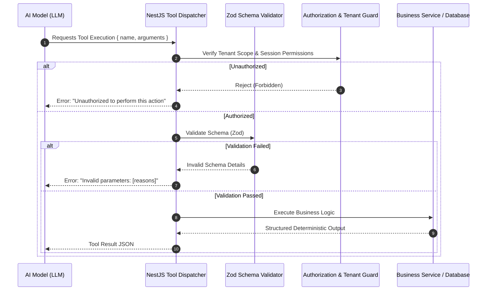

# AI Function Calling & Tool Architecture — SERVORA

---

## 1. Tool Execution Protocol

The AI receptionist interacts with the Servora system through deterministic, schema-validated functions called **Tools**. All tool executions are mediated by the backend `ToolExecutionService`.



---

## 2. In-Depth Tool Specifications

### 2.1 `get_business_info`
- **Operation Type:** Read
- **Purpose:** Retrieve public profile details for the active business (address, phone, email, facility description, policies).
- **Permissions:** Public / Anonymous
- **Inputs:**
  ```json
  {
    "type": "object",
    "properties": {
      "includePolicies": { "type": "boolean", "default": true }
    }
  }
  ```
- **Outputs:**
  ```json
  {
    "name": "Apex Detailing Studio",
    "phone": "+91 98765 43210",
    "address": "100 Feet Road, Indiranagar, Bengaluru",
    "cancellationPolicy": "Free cancellation up to 24 hours prior."
  }
  ```
- **Failure States:** Organization not found / inactive (`ORG_NOT_FOUND`).
- **Audit Requirement:** Standard telemetry log.

---

### 2.2 `get_services`
- **Operation Type:** Read
- **Purpose:** List all active services offered by the business with base rates and estimated durations.
- **Permissions:** Public / Anonymous
- **Inputs:**
  ```json
  {
    "type": "object",
    "properties": {
      "category": { "type": "string", "description": "Optional category filter (e.g. 'Coating', 'Wash')" }
    }
  }
  ```
- **Outputs:** Array of services with `id`, `name`, `category`, `basePrice`, `currency`, `baseDurationMinutes`.
- **Failure States:** None (returns empty array if no services match).
- **Audit Requirement:** None.

---

### 2.3 `get_service_details`
- **Operation Type:** Read
- **Purpose:** Fetch detailed package inclusions, warranty details, and configurable modifiers for a specific service.
- **Permissions:** Public / Anonymous
- **Inputs:**
  ```json
  {
    "type": "object",
    "required": ["serviceId"],
    "properties": {
      "serviceId": { "type": "string", "description": "Service ObjectId or slug" }
    }
  }
  ```
- **Outputs:** Service object including full description, warranty details, and modifier list (e.g. Vehicle Size options: Hatchback, Sedan, SUV with adjustment prices).
- **Failure States:** `SERVICE_NOT_FOUND`.
- **Audit Requirement:** None.

---

### 2.4 `get_business_hours`
- **Operation Type:** Read
- **Purpose:** Retrieve regular operating hours and scheduled upcoming holidays/closures.
- **Permissions:** Public / Anonymous
- **Inputs:** Empty object `{}`.
- **Outputs:** Weekly schedule array (Mon-Sun open/close times) and upcoming blackout dates.
- **Failure States:** None.
- **Audit Requirement:** None.

---

### 2.5 `get_availability`
- **Operation Type:** Read
- **Purpose:** Compute verified, bookable appointment slots for a requested service on a given date or date range.
- **Permissions:** Public / Anonymous
- **Inputs:**
  ```json
  {
    "type": "object",
    "required": ["serviceId", "startDate"],
    "properties": {
      "serviceId": { "type": "string" },
      "startDate": { "type": "string", "format": "date", "description": "YYYY-MM-DD" },
      "endDate": { "type": "string", "format": "date", "description": "Optional end date" }
    }
  }
  ```
- **Outputs:**
  ```json
  {
    "date": "2026-10-03",
    "availableSlots": [
      { "startTime": "2026-10-03T10:00:00Z", "endTime": "2026-10-03T14:00:00Z", "staffId": "stf_123" },
      { "startTime": "2026-10-03T14:30:00Z", "endTime": "2026-10-03T18:30:00Z", "staffId": "stf_123" }
    ]
  }
  ```
- **Failure States:** `DATE_IN_PAST`, `OUTSIDE_BOOKING_WINDOW`, `SERVICE_NOT_FOUND`.
- **Audit Requirement:** None.

---

### 2.6 `calculate_quote`
- **Operation Type:** Read / Deterministic Calculation
- **Purpose:** Calculate an accurate, itemized price quote for a service based on customer-selected modifiers and options.
- **Permissions:** Public / Anonymous
- **Inputs:**
  ```json
  {
    "type": "object",
    "required": ["serviceId"],
    "properties": {
      "serviceId": { "type": "string" },
      "selectedModifiers": {
        "type": "array",
        "items": {
          "type": "object",
          "required": ["modifierId", "optionLabel"],
          "properties": {
            "modifierId": { "type": "string" },
            "optionLabel": { "type": "string" }
          }
        }
      },
      "couponCode": { "type": "string" }
    }
  }
  ```
- **Outputs:**
  ```json
  {
    "basePrice": 18000,
    "modifierAdjustments": [{ "name": "Vehicle Type: SUV", "amount": 5000 }],
    "subtotal": 23000,
    "discount": 0,
    "tax": 4140,
    "finalTotal": 27140,
    "currency": "INR",
    "estimatedDurationMinutes": 270
  }
  ```
- **Failure States:** `INVALID_MODIFIER_OPTION`, `SERVICE_NOT_FOUND`.
- **Audit Requirement:** None.

---

### 2.7 `create_lead`
- **Operation Type:** Write
- **Purpose:** Capture customer contact information, vehicle/custom requirements, and interest intent before booking.
- **Permissions:** Public / Anonymous
- **Inputs:**
  ```json
  {
    "type": "object",
    "required": ["name", "phone"],
    "properties": {
      "name": { "type": "string" },
      "phone": { "type": "string" },
      "email": { "type": "string" },
      "interestedServiceId": { "type": "string" },
      "extractedIntent": { "type": "string" },
      "estimatedBudget": { "type": "number" }
    }
  }
  ```
- **Outputs:** `{ "leadId": "lead_987", "status": "QUALIFIED" }`
- **Failure States:** `INVALID_PHONE_FORMAT`.
- **Audit Requirement:** Logged with IP and conversation session ID.

---

### 2.8 `get_customer`
- **Operation Type:** Read
- **Purpose:** Look up an existing customer record by phone or email to personalize conversation.
- **Permissions:** Internal / Session Protected
- **Inputs:** `{ "phone": { "type": "string" }, "email": { "type": "string" } }`
- **Outputs:** Customer name, vehicle preferences, past booking count (PII masked).
- **Failure States:** `CUSTOMER_NOT_FOUND`.
- **Audit Requirement:** Read access logged.

---

### 2.9 `create_booking` (Critical Action)
- **Operation Type:** Write / Transactional Reservation
- **Purpose:** Atomically reserve an appointment slot, lock out double-bookings, persist the booking, and initiate confirmation notifications.
- **Permissions:** Public / Verified Session
- **Inputs:**
  ```json
  {
    "type": "object",
    "required": ["serviceId", "startTime", "customerName", "customerPhone"],
    "properties": {
      "serviceId": { "type": "string" },
      "staffId": { "type": "string" },
      "startTime": { "type": "string", "format": "date-time" },
      "selectedModifiers": { "type": "array" },
      "customerName": { "type": "string" },
      "customerPhone": { "type": "string" },
      "customerEmail": { "type": "string" },
      "notes": { "type": "string" }
    }
  }
  ```
- **Detailed Execution Pipeline:**
  1. Authenticate & assert active `organizationId`.
  2. Validate arguments via Zod.
  3. Acquire atomic distributed lock in Redis: `lock:org:<id>:slot:<startTime>`.
  4. Query database to ensure no overlapping booking exists for staff/bay.
  5. Compute deterministic price via `calculate_quote()`.
  6. Upsert customer profile in `customers`.
  7. Insert booking in `bookings` with status `'CONFIRMED'`.
  8. Release Redis lock.
  9. Enqueue `send_confirmation` job in BullMQ.
  10. Return booking summary and `bookingReference`.
- **Outputs:**
  ```json
  {
    "success": true,
    "bookingId": "bkg_456",
    "bookingReference": "BK-9021",
    "status": "CONFIRMED",
    "startTime": "2026-10-03T10:00:00Z",
    "totalPrice": 27140
  }
  ```
- **Failure States:** `SLOT_UNAVAILABLE` (409), `LOCK_ACQUISITION_FAILED` (409), `INVALID_PHONE` (400).
- **Audit Requirement:** Mandatory high-priority audit entry (`BOOKING_CREATED`).

---

### 2.10 `reschedule_booking`
- **Operation Type:** Write
- **Purpose:** Move an existing booking to a new open slot.
- **Permissions:** Customer with Booking Ref + Phone OR Staff/Admin
- **Inputs:** `{ "bookingReference": "BK-9021", "customerPhone": "+91...", "newStartTime": "..." }`
- **Outputs:** `{ "success": true, "updatedStartTime": "..." }`
- **Failure States:** `BOOKING_NOT_FOUND`, `POLICY_VIOLATION_TOO_LATE`, `SLOT_UNAVAILABLE`.
- **Audit Requirement:** Mandatory audit entry (`BOOKING_RESCHEDULED`).

---

### 2.11 `cancel_booking`
- **Operation Type:** Write
- **Purpose:** Cancel a scheduled appointment in accordance with cancellation policy.
- **Permissions:** Customer with Booking Ref + Phone OR Staff/Admin
- **Inputs:** `{ "bookingReference": "BK-9021", "customerPhone": "+91...", "cancellationReason": "..." }`
- **Outputs:** `{ "success": true, "status": "CANCELLED" }`
- **Failure States:** `CANCELLATION_DEADLINE_EXCEEDED`, `BOOKING_NOT_FOUND`.
- **Audit Requirement:** Mandatory audit entry (`BOOKING_CANCELLED`).

---

### 2.12 `send_confirmation`
- **Operation Type:** Asynchronous Job Trigger
- **Purpose:** Enqueue customer and business notification emails via BullMQ.
- **Permissions:** Internal System Only
- **Inputs:** `{ "bookingId": "bkg_456", "channels": ["EMAIL"] }`
- **Outputs:** `{ "queued": true, "jobId": "job_331" }`
- **Failure States:** `QUEUE_UNAVAILABLE`.
- **Audit Requirement:** Logged in `notifications` collection.
