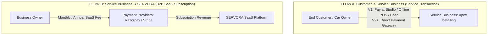
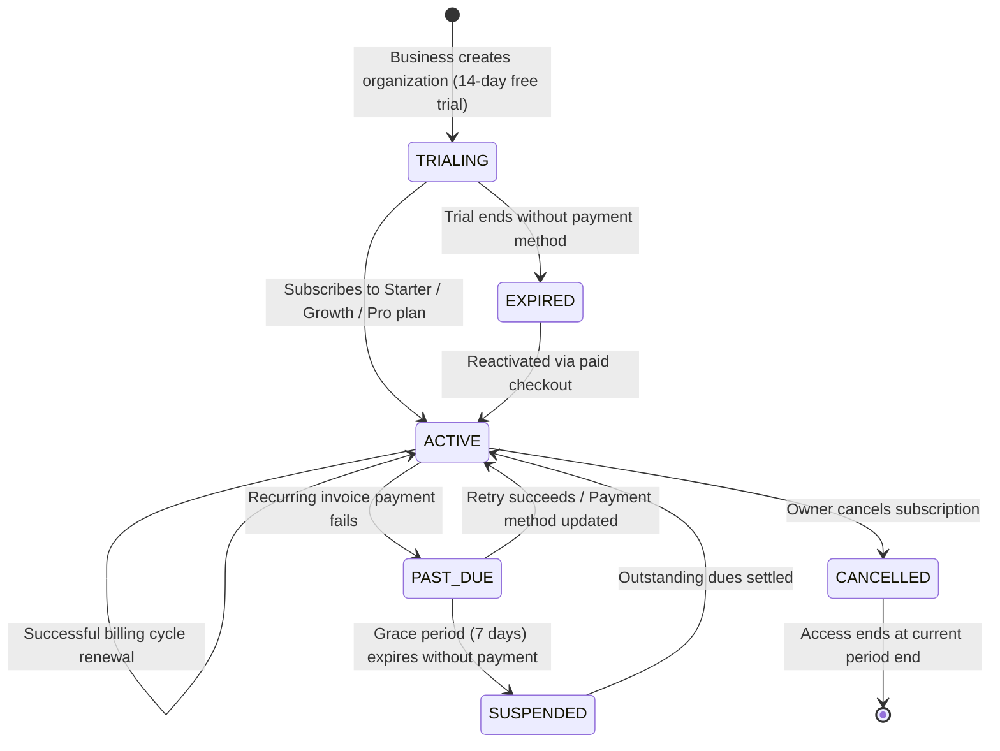

# Billing Architecture & SaaS Subscriptions — SERVORA

---

## 1. Segregation of Financial Flows

A fundamental architectural mandate of Servora is the **absolute separation of customer service transactions from SaaS platform subscriptions**.

### Architectural Separation Invariants:
1. **Flow A (Customer $\rightarrow$ Business):**
   - In V1 MVP, service payments are collected offline (cash, card swipe, UPI QR code at the detailing studio) or marked as "Pay at Studio".
   - Future V2+ payment gateway integration will deposit funds directly into the business's merchant account via Stripe Connect or Razorpay Route.
2. **Flow B (Business $\rightarrow$ Servora):**
   - B2B recurring subscription fee paid by the business to access the Servora platform.
   - Handled via Razorpay Subscriptions (for India) and Stripe Billing (for global customers).

---

## 2. Servora SaaS Subscription Lifecycle (Flow B)

---

## 3. Subscription Tiers & Feature Gates (Conceptual)

| Dimension | **Starter** | **Growth** | **Pro** |
| :--- | :---: | :---: | :---: |
| **Target Business** | Solo technician / Boutique shop | Growing studio (2–5 bays) | Multi-bay enterprise studio |
| **Monthly Bookings Limit** | Up to 50 bookings/mo | Up to 250 bookings/mo | Unlimited |
| **Staff Accounts** | 2 Staff seats | 5 Staff seats | Unlimited |
| **AI Receptionist Chats** | 200 conversations/mo | 1,000 conversations/mo | 5,000 conversations/mo |
| **RAG Knowledge Base** | Up to 10 FAQs | Up to 50 FAQs + Policies | Unlimited FAQs & Custom Tone |
| **Email Notifications** | Standard templates | Custom branded templates | Priority dispatch |

---

## 4. Webhook Processing & Resilience

Subscription state transitions are driven asynchronously by webhook events from Stripe (`invoice.payment_succeeded`, `customer.subscription.deleted`) and Razorpay (`subscription.charged`, `subscription.halted`).

### Webhook Processing Pipeline:
1. **Edge Verification:** Verify cryptographic signature using raw payload buffer before parsing JSON.
2. **Idempotent Queueing:** Extract event ID and push to BullMQ queue `billing_webhooks`.
3. **Execution:** Worker updates `subscriptions` collection status and adjusts tenant usage limits.
4. **Grace Period Management:** If an invoice fails, status updates to `'PAST_DUE'`. The tenant retains full access for a 7-day grace period while automated reminder emails are dispatched. If unresolved, tenant status transitions to `'SUSPENDED'`.
