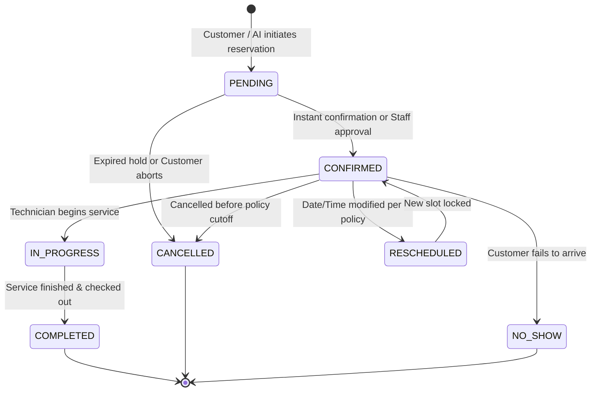
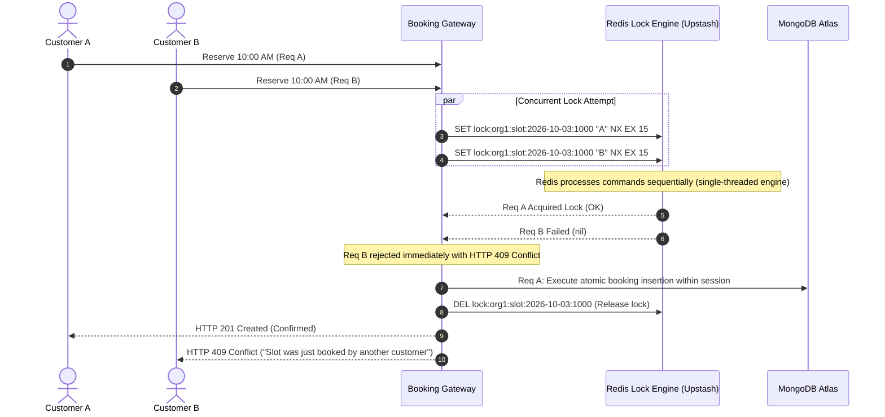

# Booking Engine Architecture & Concurrency Control — SERVORA

---

## 1. Engine Mission & Core Responsibilities

The Servora Booking Engine is a deterministic state machine and temporal calculation service. It orchestrates service durations, staff capacity, operational operating hours, technician breaks, holidays, and buffer times to deliver race-condition-free appointment scheduling.

---

## 2. Booking Lifecycle State Machine

Every appointment moves through well-defined lifecycle states. State transitions are strictly controlled and emit audit events.

### State Definitions & Permitted Transitions:
| State | Description | Permitted Next States |
| :--- | :--- | :--- |
| `PENDING` | Temporary reservation awaiting business review or payment (if enabled). | `CONFIRMED`, `CANCELLED` |
| `CONFIRMED` | Active, locked appointment in the calendar. Buffer times applied. | `IN_PROGRESS`, `RESCHEDULED`, `CANCELLED`, `NO_SHOW` |
| `IN_PROGRESS` | Customer vehicle or job is currently being serviced in the bay. | `COMPLETED` |
| `COMPLETED` | Service fulfilled. Triggers post-service follow-up and review requests. | Terminal |
| `CANCELLED` | Appointment voided. Slot is immediately freed up for booking. | Terminal |
| `NO_SHOW` | Customer did not arrive. Flagged in customer CRM stats. | Terminal |

---

## 3. Availability Calculation Algorithm

To determine whether a specific time interval $[T_{\text{start}}, T_{\text{end}}]$ can be booked for a service $S$ with duration $D$ and cleanup buffer $B$:

$$\text{Effective Slot Duration} = D + B$$

### Step-by-Step Availability Resolution:
1. **Operating Hours Filter:** Assert that $[T_{\text{start}}, T_{\text{end}} + B]$ falls entirely within the business's published operating hours for that day of the week.
2. **Holiday / Blackout Filter:** Verify that the requested date is not flagged as a business or location-wide blackout date.
3. **Staff Shift & Break Filter:** Identify staff members qualified to perform service $S$. Ensure at least one qualified staff member has a scheduled shift covering $[T_{\text{start}}, T_{\text{end}} + B]$ and is not on an active break interval.
4. **Collision Detection:** Query the `bookings` collection for any existing appointment where:
   $$\text{status} \in \{\text{'CONFIRMED'}, \text{'IN\_PROGRESS'}, \text{'PENDING'}\}$$
   and:
   $$(\text{existingStartTime} < T_{\text{end}} + B) \land (\text{existingEndTime} + \text{existingBuffer} > T_{\text{start}})$$
5. **Slot Generation:** Output non-overlapping available intervals in discrete increments (e.g., 30-minute intervals).

---

## 4. Concurrency Control & Double-Booking Prevention

### The Race Condition Scenario:
Two customers chatting with the AI receptionist simultaneously attempt to reserve the 10:00 AM Saturday slot for the same technician/bay.

### Atomic Locking Implementation Details:
- Key: `lock:org:<orgId>:staff:<staffId>:slot:<timestamp>`
- Command: `SET key uuid NX EX 15` (15-second auto-expiry prevents deadlock if server crashes).
- Release: Safe deletion using Lua script ensuring only the owner of the lock `uuid` can release it.

---

## 5. Rescheduling & Cancellation Rules Engine

1. **Minimum Notice Policy:** Configurable per organization (e.g., minimum 4 hours or 24 hours prior to appointment).
2. **Validation Rule:** If current time + policy notice window > scheduled appointment start time, the action is rejected with `POLICY_VIOLATION_TOO_LATE`.
3. **Rescheduling Limit:** Default maximum of 2 customer-initiated reschedules to prevent schedule abuse.
