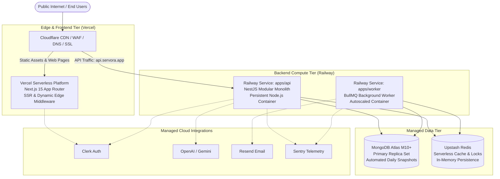
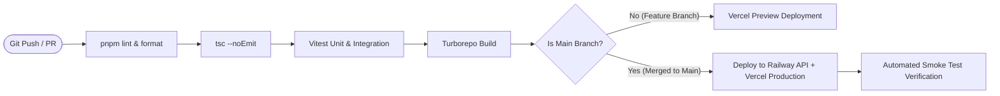

# Deployment Architecture & Infrastructure Blueprint — SERVORA

---

## 1. Cloud Topology & Runtime Infrastructure

Servora leverages a managed, modern cloud runtime topology optimized for low latency, high developer ergonomics, and minimal administrative overhead.

---

## 2. Environment Matrix

| Environment | Purpose | Domains | Datastores | Deployment Trigger |
| :--- | :--- | :--- | :--- | :--- |
| **Development** | Local developer testing | `localhost:3000` (Web) `localhost:4000` (API) | Local Docker MongoDB & Redis or dev Atlas cluster | Local branch |
| **Staging** | Pre-release QA & automated integration tests | `staging.servora.app` `staging-api.servora.app` | Dedicated Atlas Staging Cluster & Upstash Staging DB | Git push to `develop` |
| **Production** | Live customer-facing SaaS | `servora.app` `api.servora.app` | Production Atlas Multi-AZ Replica Set & High-Perf Upstash Redis | Git merge to `main` (requires CI pass) |

---

## 3. Environment Variables & Secret Management

All secrets are managed via **Railway Secrets** (API/Worker) and **Vercel Project Environment Variables** (Web):

### Backend & Worker Secrets (`apps/api`, `apps/worker`):
- `NODE_ENV`: `production` | `staging`
- `PORT`: `4000`
- `MONGODB_URI`: `mongodb+srv://<user>:<password>@cluster0.mongodb.net/servora`
- `REDIS_URL`: `rediss://default:<password>@<endpoint>.upstash.io:6379`
- `CLERK_SECRET_KEY`: `sk_live_...`
- `CLERK_PUBLISHABLE_KEY`: `pk_live_...`
- `OPENAI_API_KEY`: `sk-proj-...`
- `GEMINI_API_KEY`: `AIzaSy...`
- `RESEND_API_KEY`: `re_...`
- `SENTRY_DSN`: `https://...@sentry.io/...`
- `ENCRYPTION_KEY`: 32-byte hexadecimal string for field-level encryption.

### Frontend Variables (`apps/web`):
- `NEXT_PUBLIC_API_URL`: `https://api.servora.app`
- `NEXT_PUBLIC_CLERK_PUBLISHABLE_KEY`: `pk_live_...`
- `NEXT_PUBLIC_POSTHOG_KEY`: `phc_...`
- `NEXT_PUBLIC_POSTHOG_HOST`: `https://app.posthog.com`

---

## 4. Continuous Integration & Deployment (CI/CD)

The deployment pipeline is orchestrated using **GitHub Actions**:

---

## 5. Backup & Disaster Recovery Strategy

1. **MongoDB Atlas Backups:** Continuous Cloud Backups with point-in-time recovery (PITR) to within 1 minute of precision, plus automated daily snapshots retained for 30 days across multiple geographic regions.
2. **Zero-Downtime Rolling Deployments:** Railway supports blue-green zero-downtime rolling restarts of NestJS containers with health-check probes (`/api/v1/health`).
3. **Rollback Strategy:** Vercel allows instantaneous 1-click frontend rollbacks to prior immutable build hashes. Railway allows 1-click rollback of container image tags within 30 seconds.
