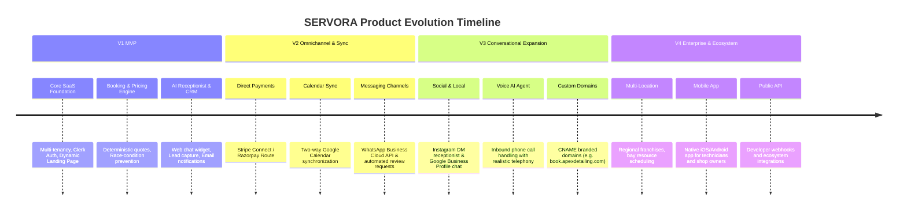

# Future Product Roadmap & Evolution Plan — SERVORA

---

## 1. Roadmap Phasing Overview

Servora is engineered with an extensible modular foundation. Following the successful delivery of the **V1 MVP**, the product evolves across three subsequent phases to capture omnichannel customer demand, automate retention, and scale to multi-location enterprises.

---

## 2. Detailed Release Breakdown

### Version 1: MVP Core Foundation (Current Target)
*Delivering the core promise: "Turn enquiries into customers."*
- **Authentication & Multi-Tenancy:** Clerk SSO, strict logical tenant isolation, RBAC.
- **Business Management:** Organization onboarding, services, staff, working shifts, and blackout dates.
- **Deterministic Engines:** Real-time slot availability generator, deterministic pricing calculator, Redis atomic locking.
- **Public Footprint:** High-converting dynamic public business landing page (`servora.app/[slug]`).
- **AI Receptionist:** Interactive web chat widget powered by OpenAI function calling with RAG business context.
- **CRM & Leads:** Automatic conversion of abandoned inquiries into qualified leads, customer profiles.
- **Notifications:** Transactional email alerts via Resend.
- **Analytics & Billing:** Tenant dashboard metrics, PostHog product telemetry, and foundational SaaS subscription tracking.

---

### Version 2: Integrated Communications & In-App Payments
*Expanding customer convenience and automating retention workflows.*
- **WhatsApp Business Cloud API:** Enable the AI receptionist to hold natural conversations and confirm bookings over WhatsApp.
- **Direct Online Payments (Flow A):** Integration with Stripe Connect and Razorpay Route allowing businesses to require deposits or full pre-payment at booking.
- **Google Calendar Two-Way Sync:** Bi-directional synchronization between staff Google Calendars and Servora availability, automatically blocking slots when technicians have personal calendar conflicts.
- **Automated Retention Drips:** BullMQ scheduled jobs triggering follow-up messages:
  - 1 hour after abandoned AI chat: "Would you like help picking a slot for your BMW?"
  - 48 hours after completed service: Automated Google Review request link.
- **AI Business Insights:** Automated weekly digest summarizing booking velocity, popular services, and suggestions for pricing or bay schedule optimization.

---

### Version 3: Omnichannel Ingress & Voice Receptionist
*Capturing inbound customers from all digital and telephony channels.*
- **Voice AI Receptionist:** Autonomous inbound phone call handling using ultra-low-latency voice pipelines (e.g. LiveKit + Deepgram + Cartesia / OpenAI Realtime) allowing car owners to call the shop phone number and speak with an AI assistant that checks live bay availability.
- **Instagram Direct Message (DM) Receptionist:** Official Meta Graph API integration enabling the AI receptionist to respond to DMs and story mentions with verified quotes and direct booking links.
- **Google Business Profile Integration:** Direct integration into Google Maps "Chat" and "Book Online" actions.
- **Custom Branded Domains:** Cloudflare for SaaS integration allowing studios to host their booking page on their own subdomain (`booking.apexdetailing.com`) with automated SSL provisioning.

---

### Version 4: Enterprise Scale, White-Label & Developer Platform
*Scaling to franchises, multi-bay networks, and agency partners.*
- **Multi-Location & Franchise Management:** Support for multi-branch organizations with shared brand profiles, regional staff, and cross-bay scheduling.
- **White-Label Agency Portal:** Allows marketing agencies to rebrand the Servora platform and resell AI receptionist services to their local clients.
- **Native Mobile Application:** React Native / Expo iOS and Android app for technicians to view assigned vehicles, log photos, inspect paint thickness notes, and mark jobs completed.
- **Public REST API & Outbound Webhooks:** Developer portal enabling businesses to connect Servora to external accounting software (e.g., QuickBooks, Tally) and custom warehouse tools.
