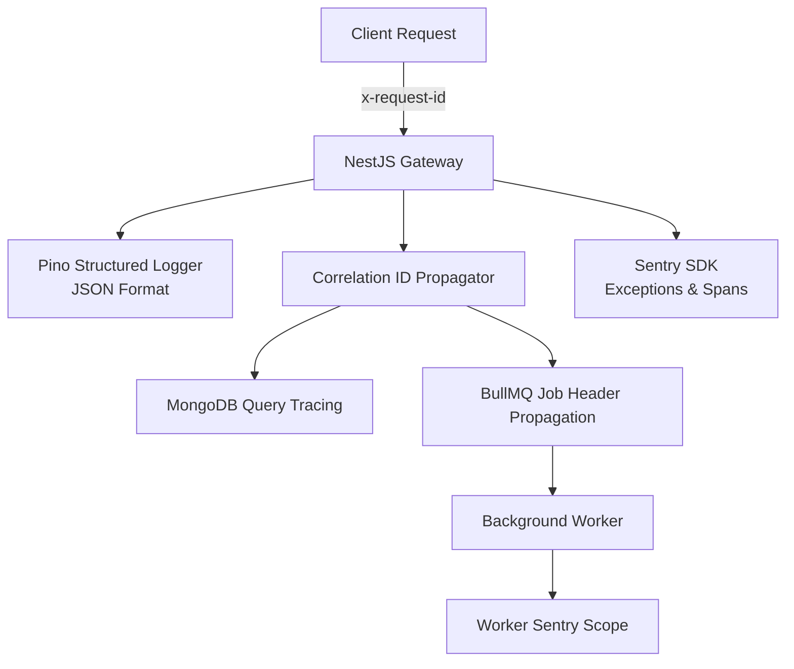

# Observability, Telemetry & Error Tracking — SERVORA

---

## 1. Observability Framework

Servora implements a comprehensive observability stack based on the three core pillars: **Structured Logs**, **Distributed Traces / Correlation IDs**, and **Proactive Metrics & Error Reporting**.



---

## 2. Request Correlation & Distributed Context

Every HTTP request entering through Cloudflare or Next.js is stamped with an `x-request-id` header (UUIDv4):
- If the client supplies `x-request-id`, it is sanitized and adopted.
- If missing, the gateway generates a fresh ID.
- The request ID is bound to `AsyncLocalStorage` and automatically included in all downstream logs, database spans, AI tool executions, and queued BullMQ jobs.

### JSON Structured Log Schema (Pino):
```json
{
  "level": "info",
  "time": 1727764800000,
  "requestId": "c4b12a88-6f11-4f91-8ad3-99b821919a01",
  "organizationId": "651a2b8e8f99a12c4012001",
  "userId": "usr_9912",
  "route": "POST /api/v1/bookings/reserve",
  "statusCode": 201,
  "latencyMs": 84,
  "message": "Booking reserved successfully",
  "bookingRef": "BK-9021"
}
```

---

## 3. Sentry Error Tracking & Contextual Triage

**Sentry** is configured across both `apps/web` (Next.js) and `apps/api` (NestJS):

### Contextual Enrichment:
Every captured exception is automatically tagged with:
- `tenant.id` / `organizationId`: Isolates errors by customer account.
- `user.id` / `user.role`: Identifies affected user.
- `environment`: `production`, `staging`, or `development`.
- `ai.provider` & `ai.model`: Attached to LLM-related failures.

### High-Priority Alerts (Slack / Email):
1. **Critical:** Cross-tenant access violation attempts (`TenantViolationException`).
2. **Critical:** Payment webhook cryptographic signature verification failures.
3. **High:** BullMQ dead-letter queue insertions (job failed after 3 retries).
4. **High:** Consecutive OpenAI rate-limit responses (HTTP 429) or circuit breaker triggers.
5. **Medium:** p95 API response times exceeding 500ms over a 5-minute rolling window.

---

## 4. AI Latency & Cost Alerting

A dedicated monitoring service tracks token burn rates:
- **Cost Alert Rule:** If total OpenAI platform spend exceeds $5.00 within any 24-hour rolling window, an alert is triggered to Platform Admins.
- **Latency Alert Rule:** If the average LLM TTFT exceeds 3,500ms, the model router dynamically evaluates switching to the backup provider or balanced model tier.
