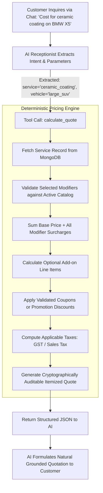

# Deterministic Pricing Engine — SERVORA

---

## 1. Architectural Philosophy: Deterministic Authority

Large language models are inherently probabilistic and must never be permitted to calculate or negotiate final prices. In Servora, **the Pricing Engine is a pure, stateless, deterministic calculation module written in TypeScript.**

---

## 2. Mathematical Calculation Specification

The final customer quote is computed using standard deterministic precision math:

### Formula:
$$\text{Base} = \text{Service.basePrice}$$
$$\text{ModifiersTotal} = \sum_{m \in \text{Modifiers}} \text{calculateModifierAdjustment}(m, \text{Base})$$
$$\text{AddonsTotal} = \sum_{a \in \text{Addons}} a.\text{price}$$
$$\text{Subtotal} = \text{Base} + \text{ModifiersTotal} + \text{AddonsTotal}$$
$$\text{DiscountAmount} = \min(\text{Subtotal}, (\text{Subtotal} \times \text{Discount}_{\%}) + \text{Discount}_{\text{flat}})$$
$$\text{TaxableAmount} = \text{Subtotal} - \text{DiscountAmount}$$
$$\text{TaxAmount} = \text{TaxableAmount} \times \text{TaxRate}$$
$$\text{FinalTotal} = \text{TaxableAmount} + \text{TaxAmount}$$

---

## 3. Concrete Example Calculations

### Scenario A: Car Detailing (Initial Vertical MVP)
- **Service:** Full Multi-Stage Ceramic Coating
- **Base Rate:** ₹18,000 (Applicable to standard Hatchback/Compact)
- **Modifier 1 (Vehicle Size):** "Full-Size SUV / BMW X5" $\rightarrow$ Flat surcharge +₹5,000
- **Add-on:** "All-Glass Hydrophobic Coating" $\rightarrow$ +₹2,500
- **Coupon:** `"FIRST10"` (10% introductory discount)
- **Tax:** 18% GST

**Step-by-Step Calculation:**
1. Base Price: ₹18,000
2. Modifier (SUV): +₹5,000
3. Add-on (Glass): +₹2,500
4. Subtotal: ₹18,000 + ₹5,000 + ₹2,500 = **₹25,500**
5. Discount (10% of ₹25,500): -₹2,550
6. Taxable Amount: ₹25,500 - ₹2,550 = **₹22,950**
7. Tax (18% of ₹22,950): +₹4,131
8. **Final Total: ₹27,081**

### Scenario B: Pet Grooming (Vertical Agnostic Proof)
- **Service:** Full Dog Spa & Grooming
- **Base Rate:** $60 (Small dog, e.g., Chihuahua)
- **Modifier 1 (Breed/Weight):** "Extra Large (>30kg, e.g., Golden Retriever)" $\rightarrow$ +$35
- **Modifier 2 (Coat Condition):** "Severely Matted Coat" $\rightarrow$ +$20
- **Subtotal:** $60 + $35 + $20 = **$115**
- **Tax (8.25%):** +$9.49
- **Final Total: $124.49**

---

## 4. Quote Types: Estimated vs. Final

To support services requiring physical inspection before commitment:

| Quote Type | Behavior | When Used |
| :--- | :--- | :--- |
| **`FINAL_GUARANTEED`** | The calculated price is binding and charged at checkout or service delivery. | Fixed standard packages (e.g. Basic Wash, Oil Change, Standard Haircut). |
| **`ESTIMATED_RANGE`** | Displays a minimum-to-maximum range; final price verified after physical in-bay inspection. | Complex restorations (e.g. Paint Correction Stage 2/3, Severe Scratch Repair). |

---

## 5. Input Validation & Integrity Controls

1. **Option Existence Check:** The engine asserts that every requested modifier option ID exists in the active service's catalog.
2. **No Arbitrary Discount Inputs:** Discounts can only be applied through registered coupon codes validated against expiration dates, usage limits, and minimum order values.
3. **Currency Integrity:** All internal calculations store integers representing the smallest currency unit (e.g., paise for INR, cents for USD) to eliminate IEEE 754 floating-point rounding errors.
