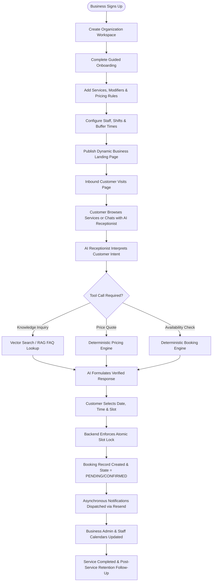

# Product Vision — SERVORA

> **Tagline:** *"Turn enquiries into customers."*

---

## 1. Executive Summary & Vision Statement

Local appointment-based service businesses lose between 40% and 60% of potential inbound customers simply because they cannot answer phone calls or reply to website messages immediately while performing skilled manual work. When a customer inquires about a premium car detailing service, a home repair, or a salon booking, delays of even thirty minutes cause the customer to look elsewhere.

**SERVORA** is a multi-tenant, AI-powered growth and operations platform built specifically for appointment-based service businesses. It acts as an autonomous, tireless digital front desk that instantly captures inbound leads, answers nuanced service inquiries using verified business knowledge, dynamically calculates deterministic quotes, matches real-time staff schedules, and books appointments directly into the business’s calendar.

### The Central Promise
> **"Turn enquiries into customers."**

Servora is **NOT**:
- A generic chatbot or simple LLM wrapper that hallucinates answers and makes empty promises.
- Just an appointment calendar (e.g., Calendly/Cal.com).
- A static CRM database (e.g., Salesforce/HubSpot).
- A generic website builder (e.g., Wix/Squarespace).
- A basic college CRUD project.

Servora is an integrated **AI Operations & Growth Platform** where conversational AI is tightly coupled with deterministic business logic, strict multi-tenancy, and real-time operations.

---

## 2. Target Market & The "Car Detailing" Launchpad

### The Initial Target Vertical: Auto & Car Detailing Studios
For initial market positioning, MVP feature prioritization, and rich demo data, Servora targets **Car Detailing Businesses**:
- High-end detailing studios
- Ceramic coating and Paint Protection Film (PPF) specialists
- Paint correction studios
- Mobile and boutique auto care businesses

#### Why Car Detailing?
1. **High Average Order Value (AOV):** Ceramic coating and multi-stage paint correction packages range from ₹15,000 to ₹100,000+ ($200 to $2,500+). Capturing even 2–3 extra leads per month transforms the studio's bottom line.
2. **Consultative Sales Process:** Detailing requires consultative inquiries: vehicle size modifiers (sedan vs. SUV vs. truck), paint condition assessments, packages, cure times, and warranty questions.
3. **High Operational Friction:** Studio owners and lead technicians work in bays wearing gloves, holding polishers, or spraying coatings; they cannot answer calls or chat windows during critical application windows.

### Crucial Architectural Constraint: Vertical Agnosticism
**Under no circumstances should car detailing be hard-coded into the architecture or database schema.**

The data model and business rules are generalized for all appointment-based and consultative service businesses:
- **Vehicle Type** is modeled as a generic **`ServiceModifier`** or **`CustomAttribute`**.
- **Paint Correction stages** are modeled as **`ServiceVariants`** or **`Addons`**.
- **Curing bay time** is modeled as **`BufferDuration`** or **`ResourceCapacity`**.

This enables instant, configuration-driven expansion into adjacent verticals:
- Salons, Barbershops, and Spas
- Pet Grooming & Veterinary Clinics
- Home Appliance Repair & Electrical Services
- Fitness Studios & Personal Trainers
- Photography, Videography & Event Services
- Cleaning, Maid, and Restoration Services

---

## 3. Core Business Workflow

The end-to-end operational lifecycle follows an uninterrupted loop from business onboarding to completed service and repeat customer acquisition:



---

## 4. Fundamental AI Philosophy: Deterministic Authority

The most common failure mode in AI-driven SaaS is allowing large language models (LLMs) to write directly to databases or hallucinate commercial terms. In Servora, **the database and deterministic business logic are the sole sources of truth.**

### The Execution Pipeline
Under no circumstances does the AI interact directly with MongoDB or state storage:

```
[Customer Message]
       │
       ▼
[AI Receptionist (LLM)]
       │ (Generates Structured Tool Call)
       ▼
[NestJS Tool Dispatcher]
       │
       ▼
[Authentication & Organization Scoping]
       │
       ▼
[RBAC & Permission Check]
       │
       ▼
[Input Validation (Zod Schema)]
       │
       ▼
[Deterministic Business Logic Engine]
       │
       ▼
[MongoDB Atlas / Atomic Lock State]
       │
       ▼
[Structured Tool Output Returned]
       │
       ▼
[AI Formulates Natural Grounded Response]
       │
       ▼
[Delivered to Customer]
```

### Inviolable Rules for AI Behavior:
1. **No Hallucinated Pricing:** The AI never estimates or calculates a price directly. It calls `calculate_quote()` which executes the business’s formal pricing matrix.
2. **No Hallucinated Calendars:** The AI never promises a slot without executing `get_availability()`.
3. **No False Confirmations:** The AI never says "Your appointment is confirmed" unless `create_booking()` has returned an explicit `bookingId` with `status: "CONFIRMED"` or `"PENDING"`.
4. **Graceful Fallbacks:** When human intervention is required, the AI transitions the conversation into a qualified `Lead` record, notifies staff, and informs the customer that a specialist will review their request.

---

## 5. Strategic Value Proposition

| Dimension | Legacy Appointment Tools (Calendly, Acuity) | Legacy Chatbots (Tidio, ManyChat) | **SERVORA** |
| :--- | :--- | :--- | :--- |
| **Interaction Model** | Static form picker; requires customer to know exactly what they need. | Scripted button trees or ungrounded generative AI. | Autonomous, conversational AI receptionist grounded in exact business parameters. |
| **Pricing Sophistication** | Flat fees or simplistic dropdown modifiers. | Incapable of calculating quotes without redirecting. | Deterministic multi-factor pricing engine (vehicle size, condition, packages, taxes). |
| **Lead Capture** | Bounces visitors who don't complete the full booking form. | Captures emails without scheduling context or qualification. | Continuous lead qualification; stores context even if the customer drops off before paying. |
| **Operational Impact** | Passive calendar utility. | Noisy message forwarder. | Active digital front desk that increases conversions and eliminates administrative overhead. |
