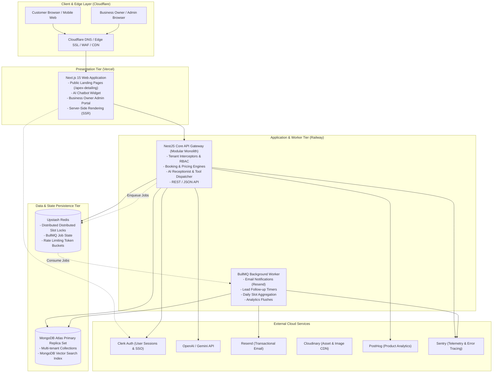
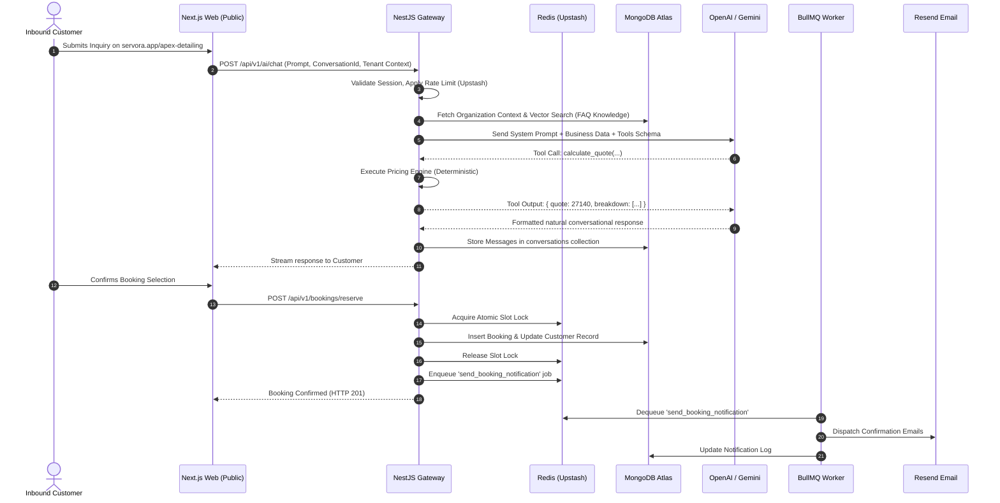

# System Architecture — SERVORA

---

## 1. High-Level Architectural Vision

Servora is designed as a **modern modular monolith with dedicated background worker processes**. It provides enterprise-grade scalability, developer ergonomics, and low operational overhead without introducing the distributed failure modes, latency penalties, and orchestration complexity of premature microservices.



---

## 2. Monorepo Structure

The project leverages a unified TypeScript workspace powered by **Turborepo** or **pnpm workspaces**:

```
servora/
│
├── apps/
│   ├── web/                     # Next.js 15 App Router (Public landing + Business dashboard)
│   ├── api/                     # NestJS REST API Gateway & Business Logic Modules
│   └── worker/                  # BullMQ Background Job Processor
│
├── packages/
│   ├── ui/                      # Shared React UI components (shadcn/ui, Radix, Tailwind)
│   ├── types/                   # Universal TypeScript interfaces, enums, and DTOs
│   ├── validation/              # Zod validation schemas shared by Frontend & Backend
│   └── config/                  # Shared ESLint, Prettier, and TypeScript configurations
│
├── docs/                        # Complete Phase 0 Architectural Documentation
├── scripts/                     # Seed scripts, migration utilities, and local dev helpers
├── .github/
│   └── workflows/               # CI/CD pipelines (Lint, Test, Typecheck, Deploy)
├── package.json                 # Monorepo root configuration
├── turbo.json                   # Pipeline build & cache orchestration
└── README.md
```

### Module Responsibilities within `apps/api` (Modular Monolith)
Inside `apps/api/src/modules/`, each domain operates with clear boundaries:
- `auth/`: Clerk webhook verification, user syncing, and RBAC guards.
- `organizations/`: Workspace creation, business profile, and tenant settings.
- `services/`: Service catalog, modifier rules, and duration metadata.
- `staff/`: Technician rosters, working shifts, and individual blackout dates.
- `availability/`: Schedule matrix computation and open slot lookups.
- `pricing/`: Pure, deterministic calculation engine for quotes.
- `bookings/`: Atomic reservations, state machine transitions, and concurrency locking.
- `customers/`: CRM contact profiles, history aggregation, and notes.
- `leads/`: Lead capture, scoring, and status transitions.
- `ai/`: Model abstraction, receptionist conversational controller, and tool router.
- `knowledge/`: Business FAQs, policies, and vector embeddings.
- `notifications/`: BullMQ queue producer for asynchronous dispatch.

---

## 3. High-Level Data Flow

The following diagram maps the lifecycle of customer requests and background tasks across runtime tiers:



---

## 4. Key Architectural Decisions & Rationales

### 4.1 Modular Monolith vs. Microservices
- **Decision:** Build a single NestJS backend (`apps/api`) with a background worker (`apps/worker`), rather than splitting into separate service microservices.
- **Rationale:** At this stage of development, microservices introduce cross-boundary network latency, complex distributed transactions, duplicated schema validation, and multi-repo deployment overhead. A modular monolith provides strict internal separation of concerns via NestJS dependency injection modules while running as a single, highly performant unit.

### 4.2 MongoDB Atlas as Primary Datastore
- **Decision:** MongoDB Atlas with Mongoose.
- **Rationale:** Flexible schema support for polymorphic service modifiers, dynamic business hours, nested booking items, conversational transcripts, and native Atlas Vector Search. MongoDB 4.0+ multi-document ACID transactions provide atomic consistency when finalizing bookings.

### 4.3 Redis for Concurrency & Asynchronous Queuing
- **Decision:** Upstash Redis powering BullMQ and distributed locks.
- **Rationale:** Eliminates race conditions in booking creation through sub-millisecond atomic locking (`SET key val NX EX`). Offloads non-critical work (email delivery, lead alerts, telemetry logging) to background workers.
