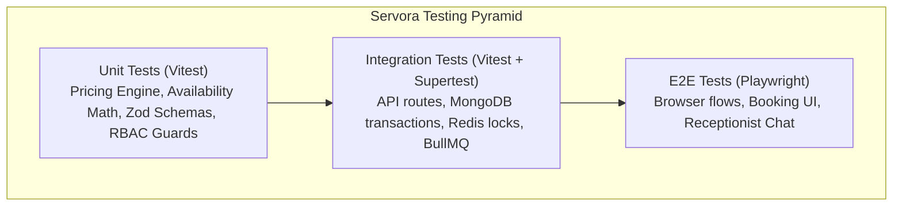

# Comprehensive Testing Strategy & Quality Assurance — SERVORA

---

## 1. Testing Pyramid & Tooling Landscape

Servora enforces a rigorous, multi-tiered testing strategy designed to prevent critical regressions—specifically focusing on **multi-tenant isolation leaks, concurrency double-bookings, and deterministic pricing mismatches**.

| Layer | Primary Framework | Target Scope | Execution Frequency |
| :--- | :--- | :--- | :--- |
| **Unit Tests** | Vitest | Pure business logic, pricing math, availability calculations, Zod validators. | On every code change / pre-commit hook (< 5s runtime). |
| **Integration Tests** | Vitest + Supertest + Testcontainers (Mongo/Redis) | REST endpoints, database transactions, concurrency locking, webhook verification. | CI pipeline on pull requests (< 60s runtime). |
| **End-to-End (E2E)** | Playwright | Full browser user journeys: Onboarding wizard, AI chat widget interaction, booking modal checkout. | Nightly CI and pre-production deployments. |

---

## 2. Critical Test Suites Matrix

### 2.1 Concurrency & Double-Booking Stress Tests
- **Objective:** Verify that under high concurrent load, an appointment slot cannot be reserved by more than one customer.
- **Test Methodology:**
  1. Instantiate two parallel HTTP `POST /api/v1/bookings/reserve` requests targeting the exact same `serviceId`, `staffId`, and `startTime`.
  2. Dispatch simultaneously using `Promise.all()`.
  3. **Assert:** Exactly one request receives `HTTP 201 Created` with a confirmed booking reference.
  4. **Assert:** The competing request receives `HTTP 409 Conflict` with a structured `SLOT_UNAVAILABLE` payload.
  5. **Assert:** The database contains exactly one booking document for that interval.

### 2.2 Strict Multi-Tenant Isolation Tests
- **Objective:** Guarantee zero cross-tenant read or write access.
- **Test Methodology:**
  1. Seed Tenant A (`org_alpha`) and Tenant B (`org_beta`) with distinct services, bookings, and customers.
  2. Authenticate as a user possessing `BUSINESS_OWNER` role exclusively within Tenant A.
  3. Issue requests querying Tenant B resources:
     - `GET /api/v1/bookings/:id_from_org_beta` $\rightarrow$ **Assert HTTP 404/403**.
     - `PATCH /api/v1/services/:id_from_org_beta` $\rightarrow$ **Assert HTTP 404/403**.
     - `GET /api/v1/customers?organizationId=org_beta` $\rightarrow$ **Assert HTTP 403 Forbidden**.
  4. Inspect database access logs to verify that the query was automatically intercepted and scoped to `org_alpha`.

### 2.3 Deterministic Pricing Engine Accuracy Tests
- **Objective:** Ensure calculations match business specifications down to the exact smallest currency unit without rounding deviations.
- **Test Matrix:**
  - Base price with single flat modifier (e.g. Sedan $\rightarrow$ +₹0, SUV $\rightarrow$ +₹5,000).
  - Multiple compound modifiers + add-ons.
  - Percentage coupons vs. flat amount discounts.
  - Tax calculation rounding compliance (half-up rounding).
  - Assert that AI cannot pass unverified discount percentages directly.

### 2.4 AI Function Calling & Tool Validation Tests
- **Objective:** Verify that LLM tool dispatch fails cleanly on invalid arguments and succeeds on compliant parameters.
- **Test Cases:**
  - `calculate_quote` invoked with missing `serviceId` $\rightarrow$ Throws Zod validation error, LLM instructed to ask customer for service selection.
  - `create_booking` invoked with phone number in non-E.164 format $\rightarrow$ Tool returns formatted validation error to LLM.
  - Injected prompt commands (e.g. "Free of charge") passed in notes field $\rightarrow$ Booking retains deterministic calculated total; prompt injection string neutralized.

---

## 3. Mocking & Fixture Strategy

To protect the $50 development budget during automated testing:
- **Unit and Integration tests NEVER invoke live OpenAI or Gemini APIs.**
- All AI provider interactions are mocked via standard fixture stubs (`MockAIProvider`) that return pre-recorded tool calls and structured responses.
- Live LLM calls are reserved solely for targeted manual smoke tests and Phase 1 prompt calibration.
