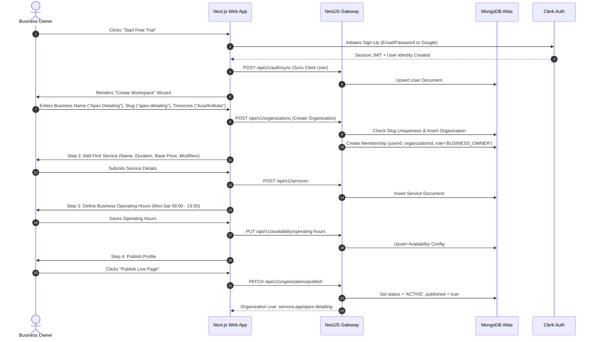
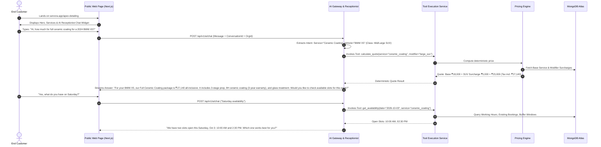
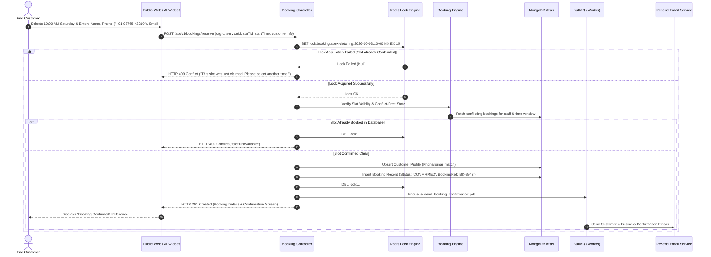
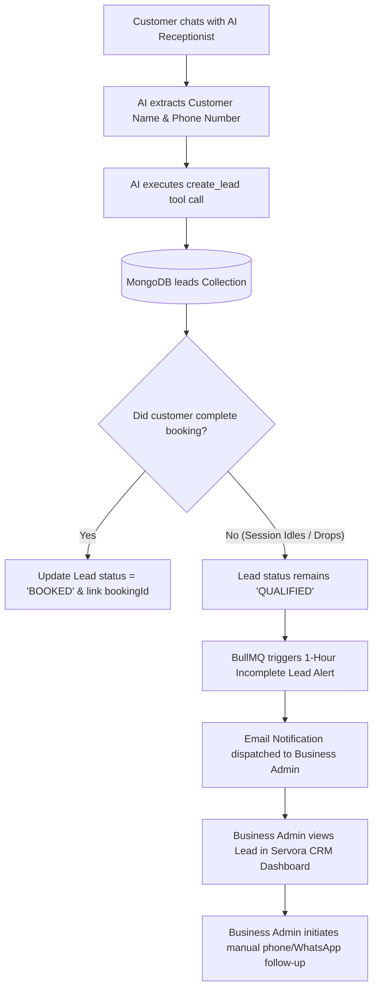
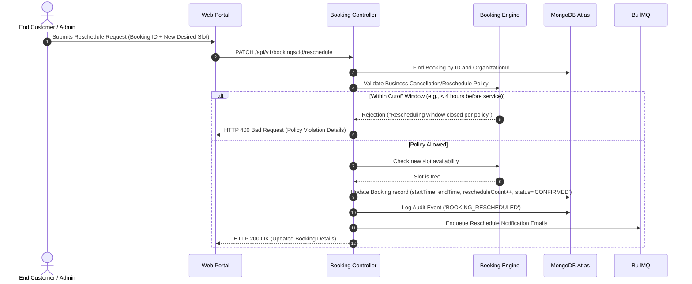

# User Flows & System Journeys — SERVORA

---

## 1. Flow 1: Business Registration & Workspace Onboarding

The business onboarding workflow transforms a newly signed-up user into a fully functional, published service organization in under 10 minutes.

---

## 2. Flow 2: Inbound Customer Journey & AI Receptionist Interaction

This flow illustrates how an unassisted customer interacts with the AI receptionist, receives a deterministic quote, and is qualified into the system.

---

## 3. Flow 3: Atomic Slot Locking & Booking Execution

This workflow shows the strict concurrency-protected booking sequence.

---

## 4. Flow 4: Incomplete Inquiry to Lead Transition

When a customer expresses interest and provides contact information but abandons the checkout flow before finalizing, the system converts the conversation into a high-value qualified lead.

---

## 5. Flow 5: Rescheduling & Cancellation Journey

