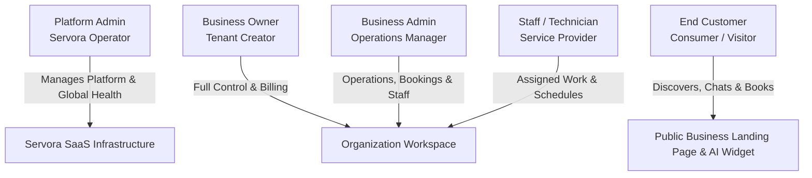

# User Personas & Role Profiles — SERVORA

---

## 1. Overview of Actor Ecosystem

Servora coordinates interactions across five distinct user roles. The system enforces strict role-based separation of concerns, ensuring that operational permissions, data visibility, and administrative capabilities are rigorously compartmentalized.

---

## 2. Detailed Role & Persona Specifications

### 2.1 Platform Admin (Servora System Operator)

| Attribute | Specification |
| :--- | :--- |
| **Persona Archetype** | **Devansh / Priya** — Servora Operations & Reliability Engineers |
| **Primary Goal** | Ensure platform stability, track cross-tenant infrastructure health, monitor AI unit economics, and manage SaaS subscriptions. |
| **Pain Points** | Runaway LLM token costs, cross-tenant data corruption risks, payment gateway webhook drops, infrastructure rate limits. |
| **System Permissions** | - Global view of all organizations, users, and subscription tiers. - Real-time AI token usage, cost aggregation, and error rate telemetry. - System-wide audit log inspection and tenant suspension/reactivation. - Platform configuration (model routing defaults, provider health checks). |
| **Typical Daily Workflow** | 1. Review Sentry exceptions and Railway/Vercel error rates. 2. Inspect PostHog platform funnel and LLM token spend across tenants. 3. Handle billing discrepancies or manually activate a partner tenant. 4. Monitor BullMQ queue depth and dead-letter queues. |

---

### 2.2 Business Owner (Organization Founder / Proprietor)

| Attribute | Specification |
| :--- | :--- |
| **Persona Archetype** | **Vikram** (38) — Owner of *Apex Auto Detailing Studio*, 2 physical bays, 4 technicians, 1 front-desk assistant. |
| **Primary Goal** | Maximize customer acquisition, minimize missed phone calls/enquiries, and run an organized, high-margin service business. |
| **Pain Points** | - Misses calls while inspecting cars or meeting clients. - Technicians double-booking bays or quoting inconsistent prices. - Customers demanding discounts or complaining about unexpected charges. - Inability to follow up with leads who asked for quotes but did not book. |
| **System Permissions** | - Full read/write over organization profile, branding, and public slug. - Manage service catalog, multi-tier pricing modifiers, and packages. - Manage staff rosters, working hours, break schedules, and bay capacity. - Full access to Leads, Customer CRM, Bookings, and Calendar. - AI Receptionist tone, RAG business knowledge, and qualification rules. - SaaS subscription management, payment integrations, and team invitations. |
| **Key Value Metric** | Net new revenue generated by AI receptionist bookings; reduction in unpaid lead leakage. |

---

### 2.3 Business Admin (Shop Manager / Operations Lead)

| Attribute | Specification |
| :--- | :--- |
| **Persona Archetype** | **Rohan** (29) — Studio Manager at Apex Auto Detailing. |
| **Primary Goal** | Ensure smooth day-to-day operations, assign technicians to incoming jobs, resolve schedule clashes, and follow up with leads. |
| **Pain Points** | Manual phone confirmation calls, dealing with late customer arrivals, tracking which technician is working on which vehicle. |
| **System Permissions** | - Create, reschedule, and cancel bookings. - Add/edit customers, log notes, and update lead statuses (`QUALIFIED` $\rightarrow$ `BOOKED`). - Edit staff working shifts and assign jobs to specific technicians. - Modify service descriptions and base availability. - **Restricted:** Cannot view or modify SaaS subscription/billing, cannot delete the organization, cannot view platform-level settings. |
| **Typical Daily Workflow** | 1. Open daily calendar view on the Servora dashboard. 2. Check new leads captured by AI overnight and review AI-generated quotes. 3. Reassign bookings if a staff member calls in sick. 4. Mark completed appointments and initiate customer follow-ups. |

---

### 2.4 Staff Member / Technician (Service Provider)

| Attribute | Specification |
| :--- | :--- |
| **Persona Archetype** | **Suresh** (24) — Senior Paint Correction and PPF Specialist. |
| **Primary Goal** | Know daily assigned work clearly, view vehicle details and requested services, and execute jobs on schedule without administrative clutter. |
| **Pain Points** | Not knowing what packages the client booked, conflicting instructions, cluttered management software with too many buttons. |
| **System Permissions** | - Dedicated, mobile-friendly view of their own scheduled appointments. - View customer name, vehicle details, requested service add-ons, and special notes. - Update appointment status: `IN_PROGRESS` $\rightarrow$ `COMPLETED`. - View assigned breaks and upcoming weekly shifts. - **Restricted:** Cannot access financial reports, customer databases of other technicians, AI settings, or organization billing. |

---

### 2.5 End Customer (Consumer / Vehicle Owner)

| Attribute | Specification |
| :--- | :--- |
| **Persona Archetype** | **Ananya** (32) — Owns a new BMW 3 Series, works long hours in consulting, values quality and immediate responsiveness. |
| **Primary Goal** | Understand what service her car needs (e.g., ceramic vs. graphene coating), get a transparent and accurate price quote, and book a confirmed slot instantly at 10:30 PM. |
| **Pain Points** | - Calling studios during the day only to get voicemail or "we'll WhatsApp you tomorrow". - Unclear pricing ("depends on the car, bring it in first"). - Complicated scheduling forms requiring endless back-and-forth emails. |
| **Interactions with Servora** | - Discovers business through Google Search, Instagram bio link, or word-of-mouth (`servora.app/apex-detailing`). - Chats with the AI Receptionist: specifies her car model, asks about coating longevity and scratch resistance. - Receives an itemized, deterministic quote calculated for her exact vehicle class. - Views actual open Saturday morning slots, selects 10:00 AM, inputs name and phone. - Receives instant email confirmation and calendar invite. |

---

## 3. Role-Based Permissions Matrix (RBAC)

| Resource / Action | Platform Admin | Business Owner | Business Admin | Staff | Customer |
| :--- | :---: | :---: | :---: | :---: | :---: |
| **Manage Organizations (Global)** |  Full |  None |  None |  None |  None |
| **Manage Organization Profile/Slug** |  Full |  Full |  Read |  None |  Read (Public) |
| **Manage SaaS Billing / Subscription** |  Full |  Full |  None |  None |  None |
| **Manage Services & Pricing Rules** |  Full |  Full |  Full |  Read |  Read (Public) |
| **Configure AI Knowledge & Tone** |  Full |  Full |  None |  None |  None |
| **Manage Staff Members & Shifts** |  Full |  Full |  Full |  Self Only |  None |
| **View Organization Bookings** |  Full |  Full |  Full |  Assigned |  Own Bookings |
| **Create / Reschedule Bookings** |  Full |  Full |  Full |  Status Only |  Self (Rules Apply) |
| **View Leads & Customer CRM** |  Full |  Full |  Full |  None |  None |
| **View Analytics & Revenue** |  Global |  Full |  Operational |  None |  None |
| **Interact with AI Receptionist** |  Test |  Test |  Test |  Test |  Public Access |
